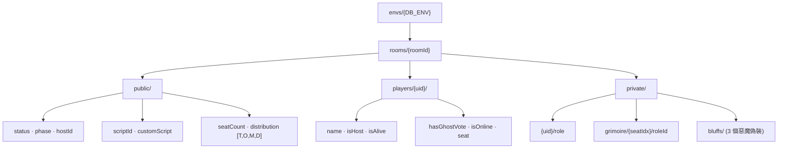

# NewClockTown

血染鐘樓（Blood on the Clocktower）的線上魔典與說書人輔助工具。

[](https://react.dev)
[](https://www.typescriptlang.org)
[](https://vitejs.dev)
[](https://firebase.google.com)
[](https://tailwindcss.com)

說書人開房、選劇本、擺魔典、發角色、主持投票；玩家用手機或電腦輸入房號加入，
即時看到座位、聊天、提名投票和自己的身分。房間狀態透過 Firebase Realtime
Database 同步，玩家匿名登入，不需要註冊帳號。

視覺走暗黑哥德 / 克蘇魯風，強制深色模式，手機版完整可用。

## 目錄

- [功能](#功能)
- [路由](#路由)
- [內建劇本](#內建劇本)
- [技術棧](#技術棧)
- [開始開發](#開始開發)
- [環境變數](#環境變數)
- [指令](#指令)
- [專案結構](#專案結構)
- [資料模型（Firebase RTDB）](#資料模型firebase-rtdb)
- [分支](#分支)
- [致謝與授權](#致謝與授權)

## 功能

- **完整魔典**：座位環、角色 Icon、說書人備註、惡魔偽裝、傳奇 / 旅行者 / 奇遇角色欄位
- **即時同步**：房間、座位、聊天、投票都走 RTDB `onValue`；玩家匿名登入即進場
- **12 套內建劇本、約 240 個角色**：官方三本加上縫合 / 原創劇本，文案全繁體中文，含相剋（Jinx）規則
- **夜晚順序表**：首夜 / 其他夜自動排序，權重取自集石（gstonegames）全域整數，桌機與手機各一種版面
- **提名與投票**：計時投票、幽靈票、票數紀錄與歷史回顧
- **遊戲覆盤**：記錄關鍵事件與盤面快照，結束後可逐步重播
- **劇本製作工具**：`/script-tool` 內建的角色 / 夜晚順序 / 相剋編輯器，可匯出 JSON、支援 AI 生成
- **上傳劇本 JSON**：說書人可直接匯入一份標準 BOTC 劇本 JSON（botcscripts / 集石 / 鐘樓劇本博物館格式）開局

## 路由

| 路徑 | 說明 |
|---|---|
| `/` | 大廳：建立房間、輸入 4 碼房號加入、更換暱稱 |
| `/room/:id` | 遊戲房（舞台中央 + 鐘樓真相 + 聊天 / 訊息） |
| `/script-tool` | 劇本製作工具 |
| `/replay/:id` | 覆盤檢視器 |

## 內建劇本

| 分類 | 劇本 |
|---|---|
| 官方 | 暗流湧動 · Trouble Brewing　\|　黯月初升 · Bad Moon Rising　\|　夢殞春宵 · Sects &amp; Violets |
| 縫合 / 社群 | 風雅集　\|　規則怪談　\|　夜半狂歡　\|　五星大廚 · Chef's Deluxe　\|　囂張跋扈 |
| 原創 / 精簡 | 無上愉悅 · No Greater Joy　\|　竊竊私語 · Whispers　\|　宿腦謎團 · Host Brain Enigma　\|　幕後操控 · Strings Pulling |

角色與劇本的單一資料源在 [`src/data/`](src/data/)。

## 技術棧

- **React 19 + TypeScript + Vite 8**（`type: module`）
- **Tailwind CSS v4**：透過 `@tailwindcss/vite`，沒有 `tailwind.config`，CSS 變數寫在 `src/index.css`
- **Firebase Realtime Database**：即時房間同步、匿名登入、App Check（reCAPTCHA Enterprise）
- **Supabase**、**Vercel AI SDK**（`ai` + `@ai-sdk/anthropic | openai | deepseek`）：劇本工具的 AI 生成
- 動畫 `framer-motion`、拖曳 `@dnd-kit`、流程圖 `@xyflow/react`
- 劇本工具子模組另用 **MUI v6 + Emotion + MobX**（與主專案的 Tailwind 世界隔離）
- Lint：`oxlint`
- 部署：Cloudflare Pages

## 開始開發

需求：Node.js 20+。

```bash
git clone https://github.com/ZhangYuShao1218/ClockTown.git
cd ClockTown
npm install
cp .env.example .env.local   # 填入 Firebase 設定
npm run dev                  # http://localhost:5173
```

### 自架

線上版連的是專屬的 Firebase 專案，而且開了 App Check —— 只有從已註冊網域載入的頁面
才拿得到通行 token，直接 clone 這份程式碼連過來會被 RTDB 擋掉。要自己架請：

1. 建立你自己的 Firebase 專案，開啟 Realtime Database 與 Anonymous Auth
2. 把設定填進 `.env.local`
3. 不填 `VITE_RECAPTCHA_SITE_KEY` 就不會啟用 App Check，其餘照舊運作

## 環境變數

複製 `.env.example` 成 `.env.local`（已被 `.gitignore` 攔截，不會提交）。

| 變數 | 必填 | 說明 |
|---|:---:|---|
| `VITE_FIREBASE_API_KEY` | ✅ | Firebase Web API Key |
| `VITE_FIREBASE_AUTH_DOMAIN` | ✅ | `your-project.firebaseapp.com` |
| `VITE_FIREBASE_DATABASE_URL` | ✅ | RTDB URL |
| `VITE_FIREBASE_PROJECT_ID` | ✅ | 專案 ID |
| `VITE_FIREBASE_STORAGE_BUCKET` | ✅ | Storage bucket |
| `VITE_FIREBASE_MESSAGING_SENDER_ID` | ✅ | Sender ID |
| `VITE_FIREBASE_APP_ID` | ✅ | App ID |
| `VITE_DB_ENV` | | 資料命名空間，RTDB 全部掛在 `envs/<VITE_DB_ENV>/` 底下。本機用 `dev`、正式用 `prod`（預設 `prod`） |
| `VITE_RECAPTCHA_SITE_KEY` | | App Check 的 reCAPTCHA Enterprise site key（公開值）。留空 = 不啟用 App Check |
| `VITE_APPCHECK_DEBUG_TOKEN` | | 本機 App Check debug token（只在 DEV 生效） |

## 指令

| 指令 | 作用 |
|---|---|
| `npm run dev` | Vite 開發伺服器（預設埠 `5173`） |
| `npm run build` | `tsc -b && vite build`（型別錯誤會擋建置） |
| `npm run preview` | 預覽 build 結果 |
| `npm run lint` | oxlint |

路徑別名 `@` → `src/`。

## 專案結構

```
src/
├── main.tsx / App.tsx        進入點與 BrowserRouter 路由
├── components/
│   ├── layout/Lobby.tsx      大廳
│   ├── game/                 遊戲房 UI：Room, CenterStage, Grimoire, Chat,
│   │                         NightOrderModal, VotingOverlay, RoleInfoModal…
│   ├── replay/               覆盤檢視器
│   ├── common/               Modal, AlertDialog, RoleIcon, RoleTooltip
│   └── script-tool/
│       ├── ScriptTool.tsx    自製外殼
│       ├── official/         鏡像整合的開源劇本工具（自有 MUI / MobX / i18n）
│       └── knowledge/botc/   BOTC 規則 RAG 知識庫
├── data/                     角色 / 劇本的單一資料源
│   ├── types.ts              Role, Script, SeatStatus, VotingState 介面
│   ├── roles/                townsfolk / outsiders / minions / demons / travelers / fabled / loric
│   ├── scripts/              每個劇本一檔 + index.ts → AllScripts
│   └── jinxes.ts             相剋（Jinx）規則
├── hooks/
│   ├── useAuth.ts            Firebase 匿名登入
│   └── useGameState.ts       訂閱 rooms/{id} 的 onValue
├── services/
│   ├── firebase.ts           app / auth / db 初始化、envs/{DB_ENV} 命名空間
│   ├── roomService.ts        房間 CRUD
│   └── replayService.ts      覆盤事件
└── lib/
    ├── utils.ts / localData.ts / highlightAbility.ts
    └── parseBotcScript.ts    外部劇本 JSON → 專案 Script
```

## 資料模型（Firebase RTDB）

所有資料掛在 `envs/{VITE_DB_ENV}/` 底下，達成正式 / 測試隔離。



玩家、房間狀態、聊天訊息各自扁平儲存，用 ID 關聯。隱私資料（角色、魔典、偽裝）
放 `private/`，為 Security Rules 預留設計空間。覆盤資料另存他處，結構見
[`replayService.ts`](src/services/replayService.ts)。

## 分支

| 分支 | 用途 | 規則 |
|---|---|---|
| `main` | 正式環境 | 不直接 push，只接受合併 |
| `Dev` | 開發整合 | 小修復直接操作；大功能開 `feature/*` |
| `Pro` | 發佈候選 | 由 `Dev` 同步 |

Commit 遵循 [Conventional Commits](https://www.conventionalcommits.org/)（`feat` / `fix` / `refactor` / `style` / `docs` / `chore` …）。

## 致謝與授權

- **《血染鐘樓》/ Blood on the Clocktower** 由 **Steven Medway** 設計，版權屬
  **[The Pandemonium Institute](https://bloodontheclocktower.com/)**。本專案是非商業性質的粉絲輔助工具，
  與 The Pandemonium Institute 無官方關係。
- 劇本與角色資料整合自 **[集石鐘樓謎團](https://clocktower.gstonegames.com/)** 與
  **鐘樓劇本博物館**（bilibili 玩家工坊）；各劇本版權歸原作者。
- `src/components/script-tool/official/` 為鏡像整合的開源劇本工具。
- 本 repo 目前未附授權條款檔。若要開源散布，請先確認上述第三方素材（尤其遊戲 IP
  與角色美術）的使用條件。
