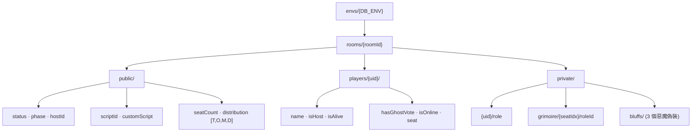

<div align="center">

# 🕰️ NewClockTown

**血染鐘樓線上魔典 & 說書人輔助工具**
_An online Grimoire & Storyteller companion for Blood on the Clocktower_

[](https://react.dev)
[](https://www.typescriptlang.org)
[](https://vitejs.dev)
[](https://firebase.google.com)
[](https://tailwindcss.com)
[](#-致謝與授權)

濃霧、古老的鐘樓、克蘇魯式的哥德氛圍 —— 一套讓說書人專心說故事、
讓玩家沉浸在推理與欺瞞裡的線上工具。

</div>

---

## 📖 目錄

- [這是什麼](#-這是什麼)
- [特色](#-特色)
- [功能導覽](#-功能導覽)
- [內建劇本](#-內建劇本)
- [技術棧](#-技術棧)
- [快速開始](#-快速開始)
- [環境變數](#-環境變數)
- [常用指令](#-常用指令)
- [專案結構](#-專案結構)
- [資料模型（Firebase RTDB）](#-資料模型firebase-rtdb)
- [分支策略](#-分支策略)
- [開發規範與 Skills](#-開發規範與-skills)
- [致謝與授權](#-致謝與授權)

---

## 🎯 這是什麼

**NewClockTown** 是一個純前端的 [《血染鐘樓》](https://bloodontheclocktower.com/)
（Blood on the Clocktower）線上輔助工具：

- **說書人**開一間房、選劇本、擺魔典、發角色、推進日夜、主持投票。
- **玩家**用手機或電腦加入同一間房，即時看到座位、公聊訊息、提名投票、自己的身分資訊。
- 整場遊戲的關鍵事件會被記錄，結束後可以**逐步覆盤**。

所有房間狀態透過 **Firebase Realtime Database** 即時同步，玩家以**匿名登入**進場，
不需要註冊帳號。

---

## ✨ 特色

| | |
|---|---|
| 🎭 **完整魔典** | 座位環、角色 Icon、說書人備註、惡魔偽裝、傳奇 / 旅行者 / 奇遇角色欄位 |
| ⚡ **即時同步** | 房間、座位、聊天、投票全部走 RTDB `onValue`；玩家匿名登入即進場 |
| 📜 **12 套內建劇本．約 240 個角色** | 官方三本 + 縫合 / 原創劇本，角色文案全繁體中文、含相剋（Jinx）規則 |
| 🌙 **夜晚順序表** | 首夜 / 其他夜自動排序，權重取自集石（gstonegames）全域整數，桌機 / 手機雙版面 |
| 🗳️ **提名與投票** | 計時投票、幽靈票、票數紀錄與歷史回顧 |
| 🎬 **遊戲覆盤** | 記錄關鍵事件與盤面快照，結束後 `/replay/:id` 逐步重播 |
| 🤖 **AI 劇本工具** | `/script-tool` 內建鏡像整合的開源劇本編輯器（MUI + MobX），支援 AI 生成角色 |
| 📤 **上傳劇本 JSON** | 說書人可直接丟一份標準 BOTC 劇本 JSON（botcscripts / 集石 / 鐘樓劇本博物館格式）進來開局 |
| 🎨 **暗黑哥德風** | 強制深色模式、濃霧與神秘學圖騰、平滑微互動，絕不血腥 |
| 📱 **響應式** | 8pt 網格、手機版完整可用 |

---

## 🧭 功能導覽

| 路徑 | 畫面 | 說明 |
|---|---|---|
| `/` | **大廳** | 建立房間 / 用 4 碼房號加入 / 更換暱稱 / 遊戲介紹 |
| `/room/:id` | **遊戲房** | 舞台中央（座位環）＋ 鐘樓真相（說書人面板）＋ 聊天 / 訊息 |
| `/script-tool` | **劇本製作工具** | 自訂角色、夜晚順序、相剋、匯出 JSON、AI 生成 |
| `/replay/:id` | **覆盤檢視器** | 逐步重播一場已結束的遊戲 |

---

## 🧩 內建劇本

| 分類 | 劇本 |
|---|---|
| **官方** | 暗流湧動 · Trouble Brewing　\|　黯月初升 · Bad Moon Rising　\|　夢殞春宵 · Sects &amp; Violets |
| **縫合 / 社群** | 風雅集　\|　規則怪談　\|　夜半狂歡　\|　五星大廚 · Chef's Deluxe　\|　囂張跋扈 |
| **原創 / 精簡** | 無上愉悅 · No Greater Joy　\|　竊竊私語 · Whispers　\|　宿腦謎團 · Host Brain Enigma　\|　幕後操控 · Strings Pulling |

> 角色與劇本的**單一資料源**在 [`src/data/`](src/data/)。要擴充新劇本請走
> [`.agents/skills/expand_script/SKILL.md`](.agents/skills/expand_script/SKILL.md) 的 SOP。

---

## 🛠️ 技術棧

| 領域 | 選型 |
|---|---|
| **框架** | React 19 · TypeScript · Vite 8（`type: module`） |
| **樣式** | Tailwind CSS v4（`@tailwindcss/vite`，無 `tailwind.config`，CSS 變數寫在 `src/index.css`） |
| **即時後端** | Firebase Realtime Database + 匿名登入 + App Check（reCAPTCHA Enterprise） |
| **資料庫 / AI** | Supabase · Vercel AI SDK（`ai` + `@ai-sdk/anthropic \| openai \| deepseek`） |
| **動畫 / 互動** | framer-motion · @dnd-kit（拖曳）· @xyflow/react（流程圖） |
| **劇本工具子模組** | MUI v6 + Emotion + MobX（與主專案的 Tailwind 世界隔離） |
| **Lint** | oxlint |
| **部署** | Cloudflare Pages（正式環境） |

---

## 🚀 快速開始

> 需求：**Node.js 20+**、npm（或 pnpm / yarn）。

```bash
# 1. 取得原始碼
git clone https://github.com/ZhangYuShao1218/ClockTown.git
cd ClockTown

# 2. 安裝依賴
npm install

# 3. 設定環境變數（見下一節）
cp .env.example .env.local
#   → 用你自己的 Firebase 專案填滿 .env.local

# 4. 啟動開發伺服器
npm run dev
#   → http://localhost:5173
```

### ⚠️ 自架者請注意

原作者的 Firebase 專案有開 **App Check**，只有從已註冊網域載入的頁面才拿得到通行 token —— 
直接 clone 這份 code 連原作者資料庫會被 RTDB 拒絕。請務必：

1. 建立**你自己的** Firebase 專案並開啟 Realtime Database + Anonymous Auth。
2. 把設定填進 `.env.local`。
3. （選用）不設定 `VITE_RECAPTCHA_SITE_KEY` 就不會啟用 App Check，照舊運作。

---

## 🔐 環境變數

複製 `.env.example` 成 `.env.local`（**絕不提交**，已被 `.gitignore` 攔截）。

<details>
<summary><b>展開變數清單</b></summary>

| 變數 | 必填 | 說明 |
|---|:---:|---|
| `VITE_FIREBASE_API_KEY` | ✅ | Firebase Web API Key |
| `VITE_FIREBASE_AUTH_DOMAIN` | ✅ | `your-project.firebaseapp.com` |
| `VITE_FIREBASE_DATABASE_URL` | ✅ | RTDB URL |
| `VITE_FIREBASE_PROJECT_ID` | ✅ | 專案 ID |
| `VITE_FIREBASE_STORAGE_BUCKET` | ✅ | Storage bucket |
| `VITE_FIREBASE_MESSAGING_SENDER_ID` | ✅ | Sender ID |
| `VITE_FIREBASE_APP_ID` | ✅ | App ID |
| `VITE_DB_ENV` | — | 資料命名空間，RTDB 全部掛在 `envs/<VITE_DB_ENV>/` 底下。本機用 `dev`、正式用 `prod`（預設 `prod`） |
| `VITE_RECAPTCHA_SITE_KEY` | — | App Check 的 reCAPTCHA Enterprise site key（公開值）。留空 = 不啟用 App Check |
| `VITE_APPCHECK_DEBUG_TOKEN` | — | 本機 App Check debug token（只在 DEV 生效） |

</details>

---

## 📦 常用指令

| 指令 | 作用 |
|---|---|
| `npm run dev` | Vite 開發伺服器（預設埠 `5173`） |
| `npm run build` | `tsc -b && vite build`（型別錯誤會擋建置） |
| `npm run preview` | 預覽 build 結果 |
| `npm run lint` | oxlint |

> 驗證改動：`npx tsc -b` 或 `npm run build`。路徑別名 `@` → `src/`。

---

## 📁 專案結構

```
src/
├── main.tsx / App.tsx        進入點與 BrowserRouter 路由
├── components/
│   ├── layout/Lobby.tsx      大廳
│   ├── game/                 遊戲房 UI：Room, CenterStage, Grimoire, Chat,
│   │                         NightOrderModal, VotingOverlay, RoleInfoModal…
│   ├── replay/               覆盤檢視器
│   ├── common/               Modal, AlertDialog, RoleIcon, RoleTooltip
│   └── script-tool/
│       ├── ScriptTool.tsx    自製外殼
│       ├── official/         ⚠️ 鏡像整合的開源劇本工具（自有 MUI / MobX / i18n）
│       └── knowledge/botc/   BOTC 規則 RAG 知識庫
├── data/                     ⭐ 角色 / 劇本的單一資料源
│   ├── types.ts              Role, Script, SeatStatus, VotingState 介面
│   ├── roles/                townsfolk / outsiders / minions / demons / travelers / fabled / loric
│   ├── scripts/              每個劇本一檔 + index.ts → AllScripts
│   └── jinxes.ts             相剋（Jinx）規則
├── hooks/
│   ├── useAuth.ts            Firebase 匿名登入
│   └── useGameState.ts       訂閱 rooms/{id} 的 onValue
├── services/
│   ├── firebase.ts           app / auth / db 初始化、envs/{DB_ENV} 命名空間
│   ├── roomService.ts        房間 CRUD
│   └── replayService.ts      覆盤事件
└── lib/
    ├── utils.ts / localData.ts / highlightAbility.ts
    └── parseBotcScript.ts    外部劇本 JSON → 專案 Script
```

---

## 🗄️ 資料模型（Firebase RTDB）

所有資料掛在 `envs/{VITE_DB_ENV}/` 底下，達成正式 / 測試隔離。



- **扁平化結構**：玩家、房間狀態、聊天訊息各自獨立，用 ID 關聯。
- **`public` / `private` 分離**：隱私資料（角色、魔典、偽裝）放 `private`，為 Security Rules 預留空間。
- 覆盤資料另存他處，結構見 [`replayService.ts`](src/services/replayService.ts)。

---

## 🌿 分支策略

| 分支 | 用途 | 規則 |
|---|---|---|
| `main` | 正式環境 | 🚫 **禁止直接 push**，只接受合併 |
| `Dev` | 開發整合 | 小修復可直接操作；大功能從這裡開 `feature/*` |
| `Pro` | 發佈候選 | 由 `Dev` 同步 |

Commit 遵循 **Conventional Commits**（`feat` / `fix` / `refactor` / `style` / `docs` / `chore` …）。
完整流程見 [`.agents/skills/version_control/SKILL.md`](.agents/skills/version_control/SKILL.md)。

---

## 🧠 開發規範與 Skills

本專案與 **Antigravity** 共用一份規範，全部放在 [`.agents/`](.agents/)，由
[`CLAUDE.md`](CLAUDE.md) 以 `@` 匯入：

- **常駐規範**：[architecture](.agents/rules/architecture.md) · [firebase](.agents/rules/firebase.md) ·
  [git-workflow](.agents/rules/git-workflow.md) · [ui-design](.agents/rules/ui-design.md)
- **Skills（依需求觸發）**
  - [`expand_script`](.agents/skills/expand_script/SKILL.md) — 從集石 / 鐘樓劇本博物館擴充新劇本的 SOP
    （夜晚順序權重一律取自集石 `grimoireRoleJson` 全域整數）
  - [`version_control`](.agents/skills/version_control/SKILL.md) — 分支策略與「提交計畫預覽」強制流程

幾條硬規矩：分離商業邏輯與 UI、Firebase 讀寫封裝進 `services/`、監聽器必須在
`useEffect` cleanup 註銷、嚴禁 `any`、`.env.local` 嚴禁提交。

---

## 🙏 致謝與授權

- **《血染鐘樓》/ Blood on the Clocktower** 由 **Steven Medway** 設計，
  版權屬 **[The Pandemonium Institute](https://bloodontheclocktower.com/)**。
  本專案是**非商業性質的粉絲輔助工具**，與 The Pandemonium Institute 無官方關係。
- 劇本與角色資料整合自 **[集石鐘樓謎團](https://clocktower.gstonegames.com/)** 與
  **鐘樓劇本博物館**（bilibili 玩家工坊）；各劇本版權歸原作者。
- `src/components/script-tool/official/` 為鏡像整合的開源劇本工具，改動時請貼近上游。

> 本 repo 目前未附授權條款檔。若要開源散布，請先確認上述第三方素材（尤其遊戲 IP 與角色美術）的使用條件。

<div align="center">

_濃霧散去之前，別相信任何人。_

</div>
